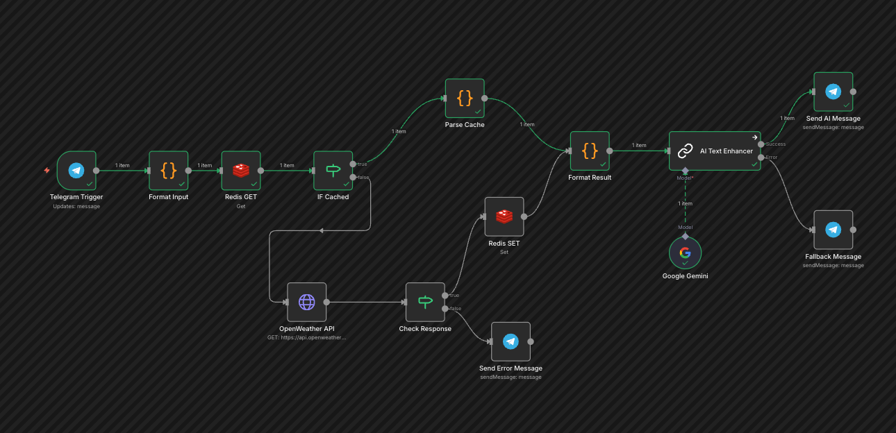

# Chatbot de Clima do Telegram 🌦️

Projeto do Bot de Clima no Telegram criado utilizando **n8n**! Este workflow conecta a sua conta do Telegram a um bot que informa a temperatura atual de qualquer cidade via a API do **OpenWeather**, além de contar, opcionalmente, com IA do **Google Gemini** para melhorar as respostas.

## 🚀 Como Funciona

1. O bot recebe o nome de uma cidade (ex: "São Paulo,SP,BR") via mensagem do Telegram.
2. O workflow faz o tratamento do texto, removendo excessos de espaço, acentuação e o formata para a pesquisa na API de clima.
3. Aciona a OpenWeather API consultando a temperatura.
4. Gera uma resposta em caso de sucesso (com arredondamentos) ou emite uma mensagem de erro padronizada (`❌ Cidade não encontrada. Use o formato Cidade,UF,BR`).
5. **Integração opcional de Inteligência Artificial:** Aciona o Google Gemini para reescrever a mensagem de maneira mais humana e um pouco mais enriquecida. Caso o Gemini não receba a credencial, um gerador estático (fallback) envia a resposta com assertividade.

## 📥 Como importar o workflow

Dentro do seu painel do n8n:

1. No menu esquerdo, acesse **Workflows** e clique em **Add Workflow**.
2. No menu superior direito da tela de edição do workflow, acesse **[•••] > Import from file**.
3. Selecione o arquivo `workflow-chatbot-telegram.json` incluído neste repositório.
4. Aguarde o fluxo carregar em sua tela.

## 🔐 Configurando Credenciais

Para que o projeto funcione adequadamente, você precisará preencher as credenciais diretamente no painel do N8N.

### 1. Telegram Bot

1. Crie seu bot com o `@BotFather` no Telegram e copie o Token gerado.
2. Acesse no painel esquerdo do n8n: **Credentials > Add Credential**.
3. Procure por `Telegram API` e clique para criar.
4. Na tela de configuração desta credencial, no campo **Access Token**, cole o token gerado diretamente.
5. Salve a credencial, por exemplo com o nome "Telegram Weather Bot".
6. **Atenção:** É perfeitamente normal que o n8n mostre um campo com o texto "Select Credential" nos nós do Telegram. Basta você clicar nesse *dropdown* nos 3 nós (Telegram Trigger, Envia Sucesso e Envia Erro) e selecionar a credencial "Telegram Weather Bot" que você acabou de criar.

### 2. OpenWeather API

1. Crie uma conta no `home.openweathermap.org` e pegue sua API Key.
2. No N8N, abra o nó **"OpenWeather API"** e, em **Authentication**, mude para **Generic Credential Type**.
3. Em **Generic Auth Type**, selecione **Query Auth**.
4. Clique para criar uma nova credencial e renomeie-a para `Openweather Api Key` (ou outro nome de sua preferência).
5. Na janela da credencial, defina o **Name** como `appid` e no **Value** cole o seu TOKEN do OpenWeather. Salve e selecione essa credencial no nó.

### 3. Google Gemini API (Opcional)

Esse passo foi configurado usando uma Corrente Básica de IA (Basic LLM Chain) conectada ao modelo do Gemini para atuar como formatador natural, garantindo o "Fallback" correto (Plano B) em caso de instabilidade:

1. Crie ou recupere sua chave de API gratuitamente em `aistudio.google.com/app/apikey`.
2. No n8n acesse: **Credentials > Add Credential**, busque por **Google Gemini API** e insira a chave gerada.
3. Feito isso, conecte a credencial criada no nó **Google Gemini** (que atua como cérebro conectado ao nó principal "AI Text Enhancer").

## 📦 Configuração do Cache (Redis)

O projeto conta com um sistema de cache no fluxo para aliviar o número de requisições na API do OpenWeather, armazenando temporariamente os dados climáticos pesquisados. 
Para sua comodidade, a credencial de conexão ao Redis já vem **previamente configurada** no arquivo `docker-compose.yml` e nos nós importados (utilizando o *host* da rede Docker local). Não é necessária configuração manual adicional se você estiver implantando os containers pelo *Compose* nativo do repositório.

## 📄 Variáveis de Ambiente (`.env-example`)

O projeto inclui um arquivo `.env-example` que serve como dicionário de referência para as ferramentas Docker, túneis e n8n. Abaixo detalhamos a função de cada chave:

| Variável | Descrição |
| :--- | :--- |
| `N8N_ENCRYPTION_KEY` | Chave de segurança para criptografar as credenciais sensíveis dentro do banco de dados do n8n. |
| `NGROK_AUTH_TOKEN` | Token do Ngrok para criar túneis que expõem o n8n para a internet (útil para registrar webhooks do Telegram). |
| `WEBHOOK_URL` | A URL pública base do seu servidor n8n (fornecida pelo provedor de túnel ou seu domínio). Ex: `https://meu-n8n.ngrok.app`. |
| `CLOUDFLARE_TUNNEL_TOKEN` | Token do seu Cloudflare Tunnel para realizar a rota de exposição segura (se utilizar o cloudflared). |
| `N8N_API_KEY` | Chave de API estática do n8n (usada pelo serviço local MCP ou acesso programático). |
| `N8N_HOST` | O endereço base do host local do servidor n8n (padrão: `http://localhost:5678/`). |
| `OPENWEATHER_API_KEY` | Sua chave de segurança na API do OpenWeather, caso queira passar por variáveis. |
| `TELEGRAM_BOT_TOKEN` | O token de autenticação bot gerado pelo BotFather do Telegram, caso queira passar por variáveis. |

## 🛠️ Troubleshooting (Solução de Problemas)

Abaixo listamos os erros mais comuns reportados no setup e uso da aplicação e as devidas resoluções:

**1. O Bot não responde a nenhuma mensagem**
*   **Motivo:** Workflow inativo ou o gatilho (Trigger) do Telegram sem credencial selecionada.
*   **Solução:** Confirme se a credencial do Telegram que você criou foi selecionada nos 3 nós do Telegram. Na parte superior do Workflow, mova também o botão deslizante para **"Active"**. 

**2. Erro de autenticação contínua no OpenWeather (`401 Unauthorized`)**
*   **Motivo:** A credencial foi configurada de maneira errada ou acabou de ser gerada.
*   **Solução:** Se a chave é nova, aguarde de 10 a 30 minutos, pois o OpenWeather possui um delay de reindexação. Verifique também em "Query Auth" se utilizou a estrutura: **Name:** `appid` / **Value:** `SuaKey`.

**3. Falha de Conexão nos Nós do Redis (Node Execute Error)**
*   **Motivo:** O *container* do banco de dados Redis não subiu na infraestrutura do Docker.
*   **Solução:** Verifique no terminal ou app *Docker Desktop* se o container contendo a imagem do `redis` está no status "Running". Reinicie os serviços usando `docker-compose up -d`.

**4. A inteligência do Gemini nunca responde, apenas as respostas estáticas**
*   **Motivo:** O nó de chat do Google Gemini falhou em autenticar via API.
*   **Solução:** Certifique-se de que criou sua API no AI Studio e selecionou corretamente a nova credencial no nó secundário rotulado com "Google Gemini Chat Model".

## ✅ Testando e Executando o Chatbot

Para começar as consultas em fase de testes (Development/Testing):

1. **Ative a escuta (listening):** Clique em **"Execute Workflow"** na parte inferior da tela do seu n8n.
2. **Envie a Cidade:** No seu aplicativo Telegram, vá até a conversa com o bot recém-criado e envie uma cidade para testar.
   - **Exemplo de Envio:** `Belo Horizonte,MG,BR`, `São Paulo,SP,BR` ou ainda, somente a cidade `São Paulo`
3. **O que esperar de retorno no Sucesso:** Em média de 2 segundos, pelo menos o nó deverá carregar e responder com sucesso:
   *🌤 A temperatura em São Paulo é de 25°C* (Podendo vir reescrito de forma mais descontraída caso a API do Gemini esteja configurada).
4. **O que esperar de retorno no Erro:** Caso você envie uma cidade fictícia (ex: `LugarNenhum`), o bot enviará a mensagem padrão:
   *❌ Cidade não encontrada. Use o formato Cidade,UF,BR (ex.: São Paulo,SP,BR).*

**Para manter online 24/7:**
Quando os testes derem certo, lembre-se de ativar o gatilho principal marcando a chave **Active** (no canto superior direito do workflow). Assim ele responderá sempre que uma pessoa chamar, sem precisar clicar no botão de teste.

---

> **⚠️ Nota Técnica: O Problema das Variáveis de Ambiente no N8N**
>
> Durante o desenvolvimento deste projeto, constatei que não é possível injetar variáveis de ambiente do Docker diretamente no *Credentials Manager* utilizando expressões (ex: `={{ $env.TELEGRAM_BOT_TOKEN }}`).
>
> Segundo pesquisas que fiz, isso ocorre porque o núcleo de segurança do N8N avalia propositalmente essas expressões de ambiente como `undefined` no escopo das credenciais geradas pela UI, visando impedir ataques de roubo de injeção em instâncias hospedadas em nuvem. Para contornar cenários em que as credenciais devem obrigatoriamente derivar de um contêiner automatizado ou `.env`, a solução sustentável (não demonstrada aqui) seria utilizar o recurso `CREDENTIALS_OVERWRITE_DATA` do n8n dentro do `docker-compose.yml`. Como esta via exige alteração avançada de variáveis, a abordagem simplificada escolhida foi a inserção manual orientada nas etapas acima.
